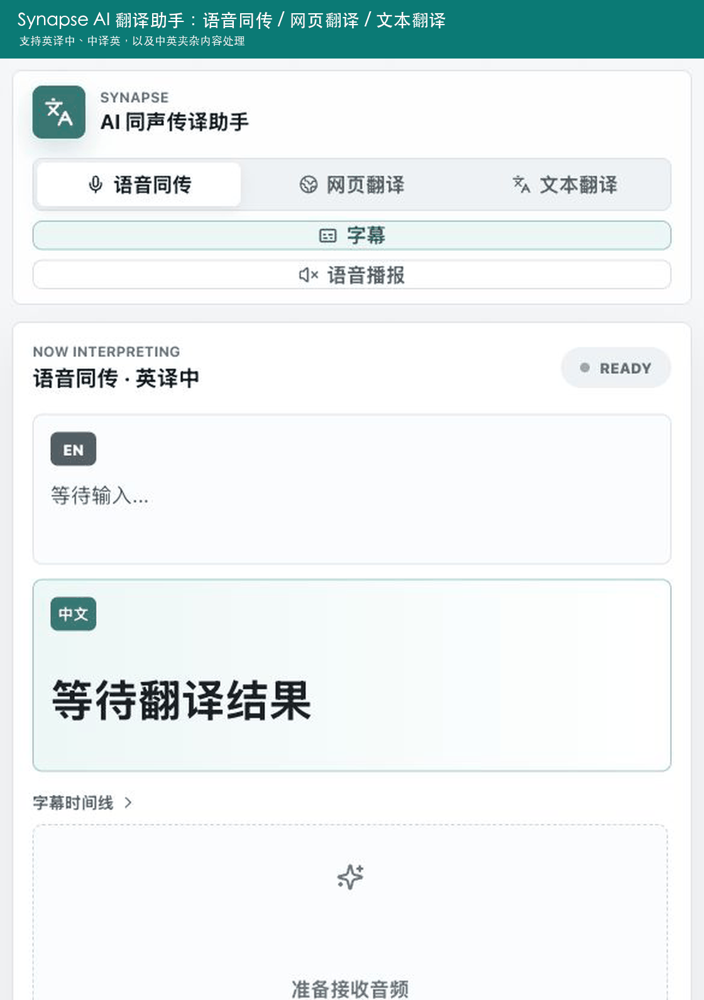
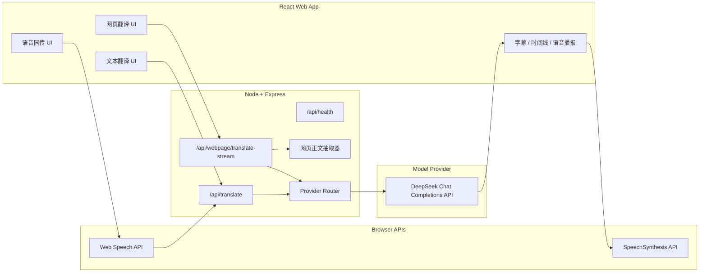

# Synapse AI 同传翻译助手

Synapse 是一个面向演讲、网课、会议和网页阅读场景的 AI 翻译 Web App。它支持语音同传、网页逐段翻译、文本翻译，并可在 `英译中` 与 `中译英` 之间切换。项目后端已接入 DeepSeek API，API key 只保存在本地 `.env`，不会暴露到浏览器前端。

> 核心目标：把用户正在听、正在看、正在读的外语内容，实时转成可理解、可追踪、可复用的目标语言结果。

## Demo

演示动图：



演示脚本：

```text
docs/demo-script.md
```

如果 GitHub 页面加载较慢，也可以直接打开：

```text
demo/synapse-demo.gif
```

## 团队协作

项目协作者与贡献说明见 [CONTRIBUTORS.md](CONTRIBUTORS.md)。

GitHub 的 `Contributor` 由提交记录自动统计。新协作者需要使用自己的 GitHub 账号完成一次 commit 并推送到 `main` 分支后，才会出现在 Contributors 列表中。

## 功能总览

### 1. 语音同传

用户切换到 `语音同传` 后，可以点击 `开始识别`。浏览器先通过 Web Speech API 把语音识别成文字，语义块稳定后，前端调用后端 `/api/translate`，后端再调用 DeepSeek 翻译。

支持：

- 英文语音转中文。
- 中文语音转英文。
- 语音播报翻译结果。
- 显示原文、译文、延迟、置信度和翻译说明。

工作链路：

```text
浏览器麦克风
-> Web Speech API 识别
-> /api/translate
-> DeepSeek
-> 前端字幕区
-> 可选语音播报
```

说明：语音同传中的中英夹杂取决于浏览器识别能力。模型可以处理混合文本，但浏览器必须先把语音正确识别出来。

### 2. 网页翻译

用户切换到 `网页翻译` 后，输入公开网页 URL，后端会抓取网页 HTML，抽取标题、段落、列表项等正文内容，然后逐段调用 DeepSeek 翻译，并以流式方式返回给前端。

支持：

- 公开 `http/https` 网页。
- 网页标题和段落抽取。
- 逐段翻译，边返回边显示。
- 英译中 / 中译英。
- 每段显示延迟、置信度和说明。

工作链路：

```text
URL
-> 后端抓取 HTML
-> 清理 script/style/iframe
-> 抽取 h1/h2/h3/p/li/blockquote
-> /api/webpage/translate-stream
-> DeepSeek 逐段翻译
-> 前端时间线展示
```

安全限制：

- 不抓取 `localhost`、`127.0.0.1`、内网 IP 或 `.local` 地址。
- 不处理需要登录或强前端渲染的网站。
- 只处理 HTML 页面，不处理 PDF、图片、视频页面。

### 3. 文本翻译

用户切换到 `文本翻译` 后，可以粘贴英文、中文，或中英夹杂内容。系统会根据当前方向统一输出为目标语言。

示例：

```text
输入：我们今天要讨论 cache policy 和边缘节点的 latency budget。
方向：中译英
输出：Today we will discuss cache policy and the latency budget of edge nodes.
```

```text
输入：This architecture 会把 streaming ASR 和回改引擎结合起来。
方向：英译中
输出：这种架构会把流式语音识别和回改引擎结合起来。
```

支持：

- 英译中。
- 中译英。
- 中英夹杂统一翻译。
- 技术术语保留和一致化。
- 置信度、延迟、说明展示。

### 4. 翻译方向切换

页面左侧提供方向切换：

- `英译中`
- `中译英`

该方向会同时影响：

- 语音识别语言。
- 网页翻译目标语言。
- 文本翻译目标语言。
- 语音播报语言。

### 5. 语音播报

开启 `语音播报` 后，翻译结果会通过浏览器 SpeechSynthesis API 朗读。

- 英译中时使用中文播报。
- 中译英时使用英文播报。
- 语速可通过左侧滑杆调整。

## 技术架构



### 前端

技术栈：

- React 18
- Vite
- lucide-react
- CSS 响应式布局

前端职责：

- 管理三个功能入口。
- 管理翻译方向。
- 展示输入原文、翻译结果、时间线、置信度、延迟。
- 对语音模式调用浏览器 Web Speech API。
- 对网页模式读取 NDJSON 流式响应。
- 对翻译结果进行可选语音播报。

### 后端

技术栈：

- Node.js
- Express
- Vite middleware
- DeepSeek API

后端职责：

- 保护 API key，不让前端直接接触密钥。
- 提供健康检查接口。
- 统一翻译请求结构。
- 根据配置选择 DeepSeek / OpenAI / 本地降级。
- 抓取公开网页并抽取正文。
- 流式返回网页段落翻译结果。

## API 设计

### GET `/api/health`

检查模型供应商和 key 是否配置成功。

返回示例：

```json
{
  "ok": true,
  "provider": "deepseek",
  "model": "deepseek-v4-flash",
  "configured": true
}
```

### POST `/api/translate`

用于语音同传和文本翻译。

请求示例：

```json
{
  "text": "我们今天要讨论 cache policy 和边缘节点的 latency budget。",
  "targetLanguage": "en-US",
  "context": [],
  "glossary": [
    {
      "en": "cache policy",
      "zh": "缓存策略",
      "locked": true
    }
  ]
}
```

返回示例：

```json
{
  "mode": "live",
  "provider": "deepseek",
  "model": "deepseek-v4-flash",
  "translation": "Today we will discuss cache policy and the latency budget of edge nodes.",
  "confidence": 95,
  "status": "stable",
  "revisionReason": "Terminology match: cache policy and latency budget.",
  "terms": ["cache policy", "latency budget"],
  "latency": 1332
}
```

### POST `/api/webpage/translate-stream`

用于网页逐段翻译。返回格式是 NDJSON，每行一个 JSON 对象。

请求示例：

```json
{
  "url": "https://example.com/",
  "targetLanguage": "zh-CN",
  "limit": 14
}
```

返回示例：

```jsonl
{"type":"meta","url":"https://example.com/","title":"Example Domain","total":2,"provider":"deepseek"}
{"type":"draft","id":"web-1","tag":"p","source":"This domain is for use in documentation examples without needing permission."}
{"type":"segment","id":"web-1","translation":"此域名用于文档示例，无需许可。","confidence":100,"status":"stable","latency":1521}
{"type":"done"}
```

## 本地运行

安装依赖：

```bash
npm install
```

复制环境变量模板：

```bash
cp .env.example .env
```

配置 `.env`：

```bash
AI_PROVIDER=deepseek
DEEPSEEK_API_KEY=sk-your-deepseek-key-here
DEEPSEEK_MODEL=deepseek-v4-flash
DEEPSEEK_BASE_URL=https://api.deepseek.com
PORT=5173
```

启动：

```bash
npm run dev
```

访问：

```text
http://localhost:5173/
```

构建：

```bash
npm run build
```

生产启动：

```bash
npm run start
```

## GitHub 提交前检查

不要提交 `.env`。项目已通过 `.gitignore` 排除：

```text
.env
node_modules/
dist/
.pdf-build/
```

提交前建议运行：

```bash
npm run build
curl http://localhost:5173/api/health
```

## 项目结构

```text
.
├── src/
│   ├── main.jsx          # React 主应用
│   └── styles.css        # 页面样式
├── server/
│   └── index.mjs         # Express 后端与模型调用
├── docs/
│   └── demo-script.md    # Demo 录制脚本
├── demo/
│   └── synapse-demo.gif  # Demo 动图
├── .env.example          # 环境变量模板
├── package.json
└── README.md
```

## 当前限制与下一步

当前限制：

- 语音识别依赖浏览器 Web Speech API，不同浏览器支持程度不同。
- 语音模式的中英夹杂识别可能不如文本模式稳定。
- 网页翻译只能处理公开 HTML 页面。
- 强反爬、登录态、客户端渲染页面可能抽取不到正文。

下一步可以迭代：

- 浏览器插件模式，直接翻译当前网页或视频页面。
- 系统音频捕获，支持 YouTube、网课和会议软件声音。
- 用户自定义术语库。
- 翻译历史与导出。
- PDF / 文档上传翻译。
- 网页翻译结果摘要和重点提炼。
